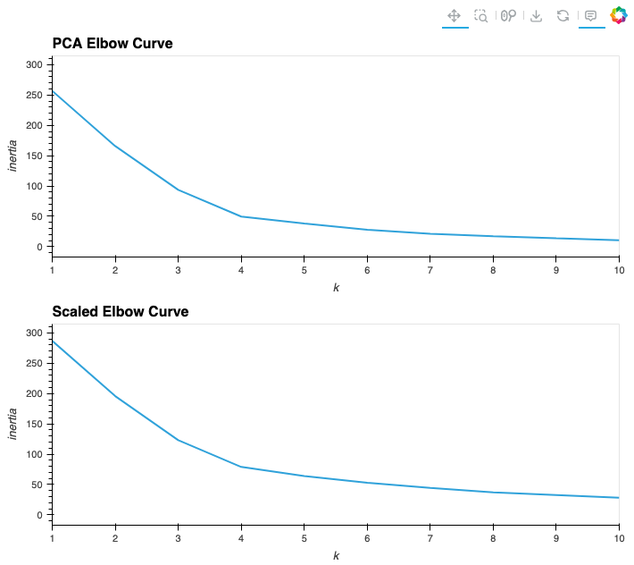
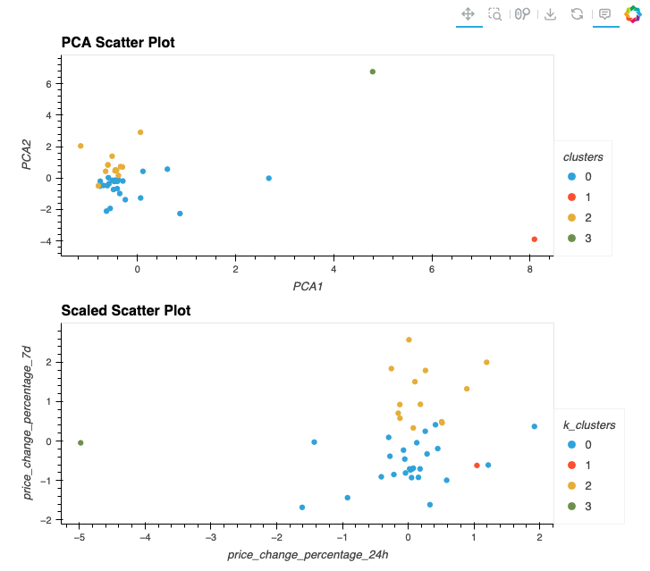

# CryptoClustering

## Table of Contents

- [Instructions](#instructions)
- [Contents of the Repository](#repository_contents)
- [Questions and Answers](#questions)
- [Givens](#givens)

## Instructions
In this challenge, you’ll use your knowledge of Python and unsupervised learning to predict if cryptocurrencies are affected by 24-hour or 7-day price changes.

## Repository_Contents
There is 1 coding deliverable called Crypto_Clustering.ipynb which contains all of the code in the challenge 
Inside of Resources is the data used in the code. 

## Questions
All Questions are answered inside of the jupyter notebook file 
Below you will find a sample view of the resulting graphs. First the Elbow curves.  

 

Next the Resulting Scatter Plots  

## Givens
Most of my process was very straight forward. I completed all of the working testing along the way. 
All code was generated by myself or by EDX. 
Dataset created by the United States Geological Survey.  
Data for this dataset and instructions were generated by edX Boot Camps LLC, and is intended for educational purposes only.
